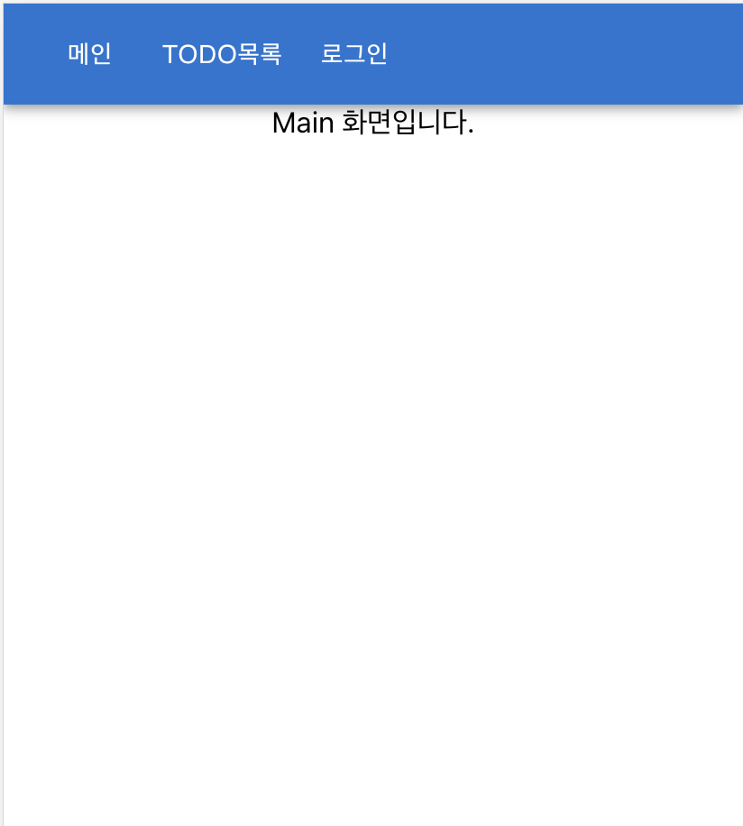
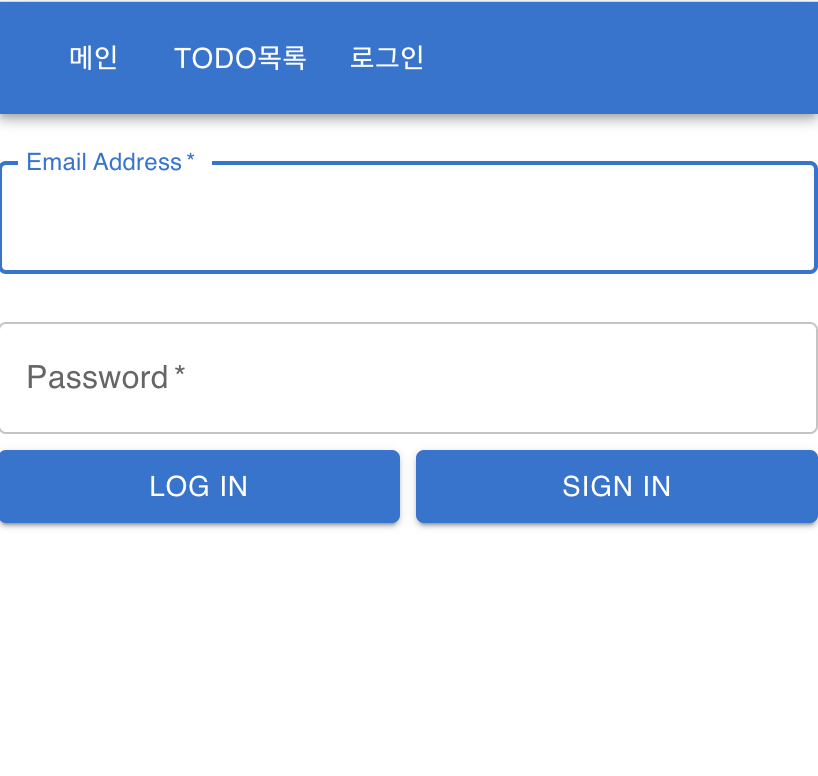
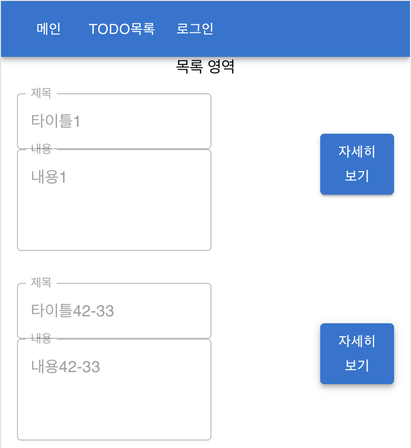
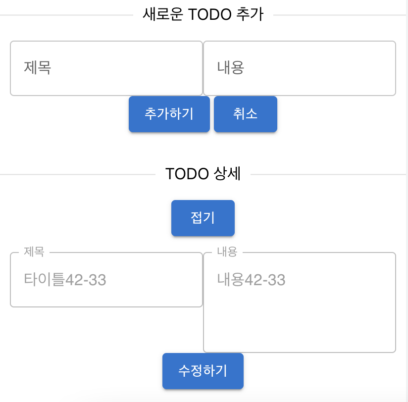
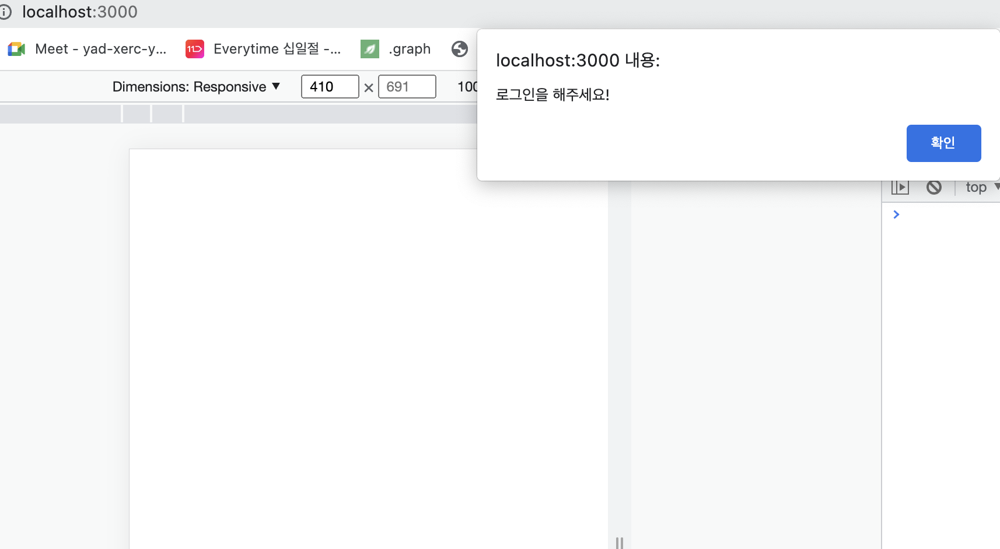
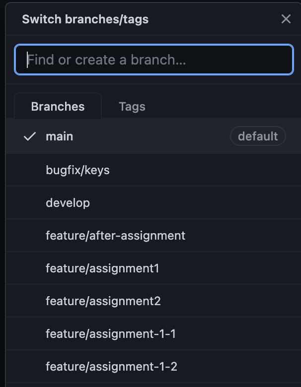
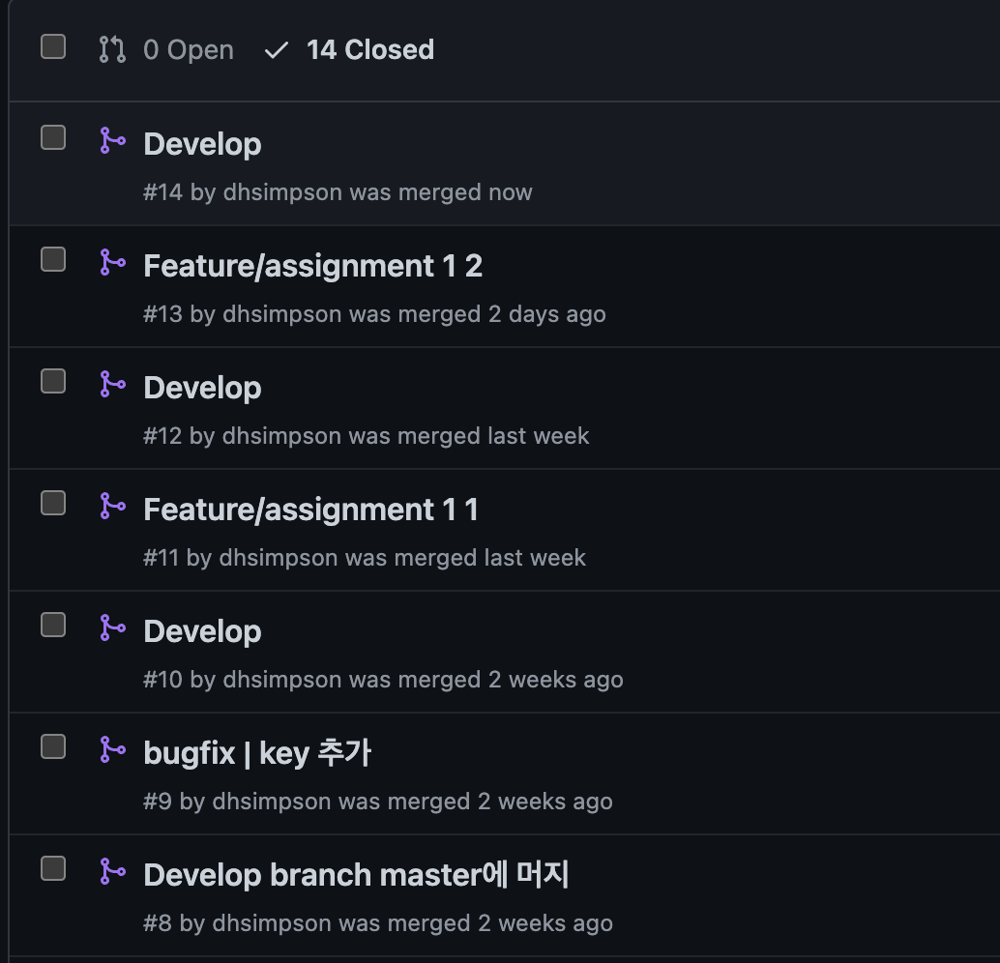

# 화면 구성

### [메인화면]

- 경로 : /
- 기능이 없는 메인 화면
- 

### [로그인/회원가입 화면]

- 경로 : /auth
- 로그인, 회원가입 기능
- 

### [Todo리스트 화면]

- 경로 : /todos
- todo 리스트를 볼 수 있고, 자세히 보기 버튼, todo 추가 버튼이 있는 화면
- 

### [Todo 상세 화면]

- 경로 : /todos/[id]
- todo 리스트 영역 하위에 노출되며, 수정하기, 삭제하기 기능이 있는 화면
- 접기 버튼 클릭 시 'Todo리스트 화면'으로 route
- 

### [로그인 Alert]

- 로그인/회원가입 화면 이외 화면 진입 시 Alert, 확인버튼 클릭 시 로그인/회원가입 화면으로 route
- 

<br/>
<br/>

# 요구사항

## Login/Signup

<br/>

- [x] /auth 경로에 로그인 / 회원가입 기능을 개발 (이메일 & 비밀 input, 제출 button)
- [x] 이메일과 비밀번호의 유효성을 확인 (이메일에 '@ .' 포함, 비밀번호 8자 이상)
- [ ] 이메일과 비밀번호가 모두 입력되어 있고, 조건을 만족해야 제출 버튼이 활성화
- [x] 로그인 API를 호출하고, 올바른 응답을 받았을 때 루트 경로로 이동
      <br/>

## Todo CRUD

<br/>

- Todo List API를 호출하여 Todo List CRUD 기능을 구현
  - [x] 목록 / 상세 영역으로 나누어 구현
  - [x] Todo 목록을 볼 수 있음
  - [x] Todo 추가 버튼을 클릭하면 할 일이 추가됨
  - [x] Todo 수정 버튼을 클릭하면 수정 모드를 활성화하고, 수정 내용을 제출하거나 취소 가능
  - [x] Todo 삭제 버튼을 클릭하면 해당 Todo를 삭제할 수 있습니다.
- 한 화면 내에서 Todo List와 개별 Todo의 상세를 확인할 수 있도록 해주세요.

  - [x] 새로고침을 했을 때 현재 상태가 유지되어야 합니다.
  - [x] 개별 Todo를 조회 순서에 따라 페이지 뒤로가기를 통하여 조회할 수 있도록 해주세요.
  - [x] 한 페이지 내에서 새로고침 없이 데이터가 정합성을 갖추도록 구현해주세요
  - [x] 수정되는 Todo의 내용이 목록에서도 실시간으로 반영되어야 합니다

  <br/>

# 개발 전략 : git flow

- 개발은 develop 브랜치에서 생성한 feature 브랜치를 이용한다.
- 브랜치 이름 규칙 : feat/[과제번호], bugfix/[버그이슈]
  - 
- code integration
  1. 개발 완료 후 develop 브랜치에 Pull Request 및 머지,
  2. 이후 develop 브랜치를 main 브랜치에 Pull Request 및 머지 한다.
  - 

# [API ReadME](https://github.com/starkoora/wanted-pre-onboarding-challenge-fe-1-api)

<br/>

# 프로젝트 실행

```
yarn (or yarn install)
yarn start
```

<br/>

# 프로젝트 셋팅

1. yarn 버전을 berry 로 변경 및 프로젝트 초기화

```
yarn set version berry
yarn init(yarn 관련 파일 생성)
yarn install(berry 는 pnp가 기본이므로 node_modules 대신 pnp 생성)
```

c.f.) [\*.test.tsx 오류 해결 방법](https://mmsesang.tistory.com/entry/Yarn-berry-yarn-pnp-%ED%99%98%EA%B2%BD%EC%9C%BC%EB%A1%9C-React-Typescript-%ED%94%84%EB%A1%9C%EC%A0%9D%ED%8A%B8-%EC%84%B8%ED%8C%85%ED%95%98%EA%B8%B0#:~:text=Allow%EB%A5%BC%20%EB%88%8C%EB%9F%AC%EC%A4%8D%EB%8B%88%EB%8B%A4.-,7.%20jest%2Ddom%20%EC%9E%AC%EC%84%A4%EC%B9%98,-%EC%97%AC%EA%B8%B0%EA%B9%8C%EC%A7%80%20%EC%A7%84%ED%96%89%ED%95%98%EA%B3%A0%20yarn)

c.f.) [airbnb eslint + prettier 셋팅](https://velog.io/@9rganizedchaos/%EA%B0%9C%EB%B0%9C-%EC%B4%88%EA%B8%B0-%EC%84%B8%ED%8C%85%ED%95%98%EA%B8%B0-ESLint-eslint-config-airbnb-typescript-Prettier-React-TypeScript)

c.f.) [react nested route : /todos/:id](https://www.robinwieruch.de/react-router-nested-routes/)

# Package Manager

- version : yarn berry (3.x.x, yarn LTS)

# 모듈 관리

- pnp (plug and play)

# 설치 할 라이브러리 목록

[For Product]

- React (FE 개발 라이브러리)
- React-router-dom (react 의 라우팅 라이브러리)
- Material UI (머티리얼 스타일의 react 컴포넌트 제공)
- axios (api 쿼리)
- react-query (서버 state를 전역 scope로 관리하는 라이브러리. hooks 제공)
- recoil (react 의 client state을 전역 scope로 상태 관리하는 라이브러리. hooks 제공)
- history (react 라우터 커스터마이징)

[For Dev]

- typescript
- eslint
- prettier

<br/>

# 이슈

- react 는 pnp 를 지원하지 않는 것인가? yarn start 로 react dev모드 실행시키면 node_modules가 생성 된다.

<br/>

# 프로젝트 디렉터리 구조

프로젝트에서 기능별로 가장 중요한 요소들을 src의 차상위 디렉터리 레벨로 관리

- (pages | component | hooks | api | atom | utils)

```
├── node_modules
├── package.json
├── public (이미지 등의 정적파일 저장)
│   └──  readme
└── src
    ├── api (api 메서드 및 타입interface)
    ├── atom (recoil 로 관리하는 state)
    ├── component (각 page 에서 사용하는 컴포넌트)
    │   ├── TodoDetail
    │   ├── common
    │   ├── modal
    │   └── nav
    ├── hooks (custom hooks)
    ├── pages (각 라우팅 화면을 관리)
    │   ├── Auth
    │   ├── Todos
    │   │   └── TodoDetail
    │   └── main
    └── utils (util 함수)
```

<br/>

# 과제 진행시 주안점

1. 어떻게 하면 더 우아한 코드 구조를 짤 수 있을까?
   - 관심사의 분리 + 디렉터리 구조
   - 커스텀 hooks
2. 타입스크립트를 잘 써보려고, 타입스크립트가 왜 필요한지 받아들이기 위한 고민
3. 리액트에서 컴포넌트 life cycle hook 을 hooks 로 어떻게 구현했는가.

<br/>

# 한계점 및 개선사항

1. 가장 좋은 핑계인 "현업이 바빠서.." "가족일 때문에..." 에 모두 해당됐던 나.
   - 가능한 시간을 내서 새벽까지 과제 한 거라구욧!!!
   - 과제에서 수행하지 못한 부분은 챌린지 이후에 라도 하자(학습 부채가 쌓여버렸다!!!)
   - 사실상 생각해 보면 리액트나 FE에 대한 지식부족으로 과제 내용을 충분히 못 따라간 것이 아닐까...
   - react-query 의 깊이 있는 학습도 못했고, UI/UX & 디자인도 아름답지 못하다.
   - 그럼에도 불구하고 학습한 것이 많다.
     - 리린이(react kid) 로써 알면 좋을 것들 (ex hooks, ref, setState...)
     - 좋은 프론트엔드 개발자가 되기 위해 알아야 할 것들 (ex 렌더링 최적화, 비제어 컴포넌트, 쓰로슬링...)
2. 다른 사람의 코드를 보는 것에 익숙해졌다!
   - '내코드' 안 개구리 였던 내가, 오픈소스를 보고 참고하게 되었다..!
3. 숲을 보는 능력!(hooks)
   - 여러 컴포넌트에서 공통되는 기능을 hooks 로 만드는 것을 이해하는데에 숲을 보는 능력의 중요성을 깨달았다.
   - '재사용 로직을 메서드로 만들기' 와 비슷한 맥락이 아닐까 싶다.

<br/>

# ‘개발자로서의 나’ 특징 정의해보기

1. 좋은 개발자 될 결심
   - 12월 챌린지에선 '모노레포와 개발환경 셋팅' 으로 개발 능률을 높일 노오력을 할 줄 아는 개발자가 됐다.
   - 이번 챌린지에선 '관심사의 분리, 디렉터리 구조' 로 유지보수하기 좋은(aka 가독성이 좋은) 코드를 만드는 방법을 아는 개발자가 됐다.
   - 그간 관심이 없던(관심이 없던 것일까 무지했던 것일까) 렌더링 최적화, 서버 state 캐싱(react-query) 최적화 에 관심을 갖는 개발자가 됐다.
2. 단점 줄여나가기
   - 만 2년차 개발자 임에도 불구하고, 긴 방랑의 시기로 인해 물경력자가 돼버렸다.
   - 인공지능 -> BE개발자 -> 인프라개발자 -> FE개발자 로 최종 정착!
   - 그러나 실질적인 FE 개발 경력은 만 1년...(이 얼마나 아름다운 물경력인가!)
   - 방랑의 시기는 오히려 좋은 경험이었다. (갈수록 FE개발자도 인프라, BE에 대한 이해도가 높아야 한다.)
   - 물경력을 채우기 위해 하나하나 알아가기. 도전하기.
     - 12월, 1월 챌린지에 이어 곧 있을 프리온보딩 코스에도 도전할 계획이다.
     - 하나를 가르치면 열을 알자!
       - 교육때 배운 내용 하나를 공부하다 보면 새로 공부할 열개가 생겨 나더라.. 하지만 1월 챌린지에서 발생한 학습 부채 중 절반은 탕감했다! (쌓여가는 자료 레퍼런싱..!)
3. FE 개발자로써의 아하! 모먼트

- FE 개발자는 뭐가 중요하지? html, js, css.... 이런 거 말고
  - 크게 2가지 : 유저 경험, 개발자 경험
  - 유저 경험은 너무나 당연히 중요하다.
  - 개발자 경험이 좋을 수록 빠른 업데이트가 가능해 지고, 이는 좋은 유저 경험으로 이어진다.
- 유저 경험은 어떻게 좋게 만들까?
  - url 접속 부터 화면 렌더링 까지의 시간 단축을 시켜야 겠다! -> SSR 을 적용해 볼까(NextJS)! 리소스 크기를 줄여볼까!(webpack 등의 최적화)
  - 유저 인터렉션 시에 지연시간을 최대한 줄여야 겠다! -> 쓰로슬링! useMemo! 렌더링 최적화!
- 개발자 경험은 어떻게 좋게 만들까?
  - 숲 레벨 : 모노레포, 디렉터리 구조 정리, 코드 리뷰 활성화, 문서화, 개발 스타일 통일(esLint, prettier)
  - 나무 레벨 : 관심사의 분리, 좋은 라이브러리 적용하기
    - 고민 : 외부 라이브러리는 언젠가 문제가 된다. vueJS 2에서 쓰던 라이브러리가 vueJS 3 를 미지원해 직접 구현해야 되는 문제가 있었다.
